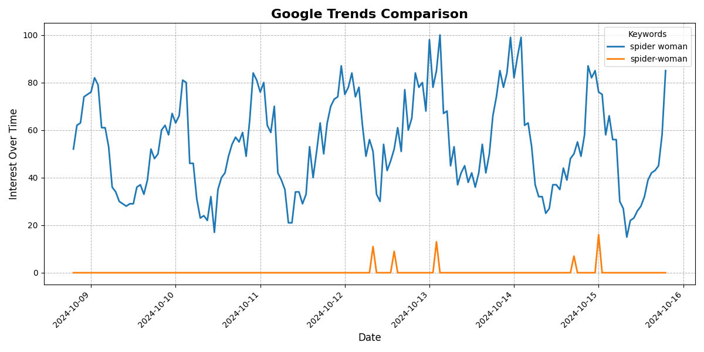
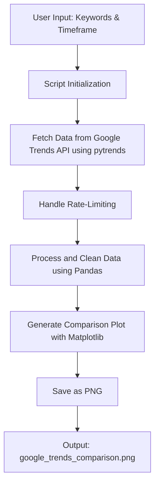

<h1 align="center">📊 <a href="https://github.com/ronknight/google-trends">Google Trends Comparison Script</a></h1>

<h4 align="center">🔧 A Python-based script to compare the popularity of multiple keywords using Google Trends data.</h4>

<p align="center">
  <a href="https://twitter.com/PinoyITSolution"></a>
  <a href="https://github.com/ronknight?tab=followers"></a>
  <a href="https://github.com/ronknight/ronknight/stargazers"></a>
  <a href="https://github.com/ronknight/ronknight/network/members"></a>
  <a href="https://github.com/ronknight/google-trends/issues"></a>
  <a href="https://github.com/ronknight/google-trends/blob/master/LICENSE"></a>
  <a href="https://github.com/ronknight"></a>
</p>

<p align="center">
  <a href="#overview">Overview</a> •
  <a href="#features">Features</a> •
  <a href="#prerequisites">Prerequisites</a> •
  <a href="#how-to-use">How to Use</a> •
  <a href="#example-output">Example Output</a> •
  <a href="#visualization">Visualization</a> •
  <a href="#error-handling">Error Handling</a> •
  <a href="#license">License</a>
</p>

## Overview

This Python script allows you to compare the popularity of two or three keywords over a specified timeframe using Google Trends data. The script fetches interest over time for the provided keywords and visualizes the trends using matplotlib, saving the comparison as a plot image.

## Features

- Compare the search interest of **2 or 3 keywords** over a custom time period.
- **Supports multiple timeframes**, including the past 7 days, past 12 months, and custom date ranges.
- Outputs a **visual plot** of the trends, saved as a `.png` image.
- Uses the **Google Trends API** (`pytrends`) to fetch real-time or historical trend data.
- Handles **rate-limiting** with an optional delay between requests to avoid being blocked by Google.

## Prerequisites

Before running the script, ensure you have the following Python packages installed:

- `pytrends`
- `matplotlib`
- `pandas`

You can install the required packages using:

```bash
pip install pytrends matplotlib pandas
```

## How to Use

1. **Run the script** by passing at least two required keywords and an optional third keyword. Additionally, you can specify a timeframe.

2. **Command-line Usage**:

   ```bash
   python google_trends_compare.py <keyword1> <keyword2> [--keyword3 <keyword3>] [--timeframe <timeframe>]
   ```

   - `<keyword1>`: The first keyword for comparison.
   - `<keyword2>`: The second keyword for comparison.
   - `--keyword3 <keyword3>`: (Optional) A third keyword to compare.
   - `--timeframe <timeframe>`: (Optional) Specify the time range for comparison. Defaults to `today 12-m`.

3. **Timeframe Options**:
   - `now 1-d`: The last 24 hours.
   - `now 7-d`: The last 7 days.
   - `today 12-m`: The past 12 months.
   - Custom timeframe using `YYYY-MM-DD YYYY-MM-DD` format, for example: `"2020-01-01 2024-01-01"`.

4. **Example Commands**:
   
   Compare two keywords (`"Python"` and `"Java"`) over the last 7 days:
   ```bash
   python google_trends_compare.py "Python" "Java" --timeframe "now 7-d"
   ```

   Compare three keywords (`"spiderman"`, `"batman"`, `"superman"`) over the last 12 months:
   ```bash
   python google_trends_compare.py "spiderman" "batman" --keyword3 "superman" --timeframe "today 12-m"
   ```

5. **Output**:
   - The script will save a plot of the trends as `google_trends_comparison.png` in the current working directory.

## Example Output

The script generates a comparison plot of the search trends, such as the one below:



## Visualization

The flow of the Google Trends Comparison Script is visualized below using Mermaid:



## Error Handling

- The script will handle cases where **no data is available** for the specified keywords.
- In cases where Google returns a `400` error, the timeframe or keyword formatting may be incorrect.

## License

This project is licensed under the MIT License - see the [LICENSE](LICENSE) file for details.
