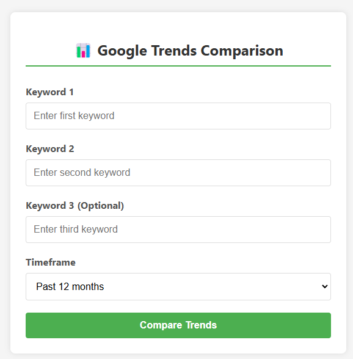
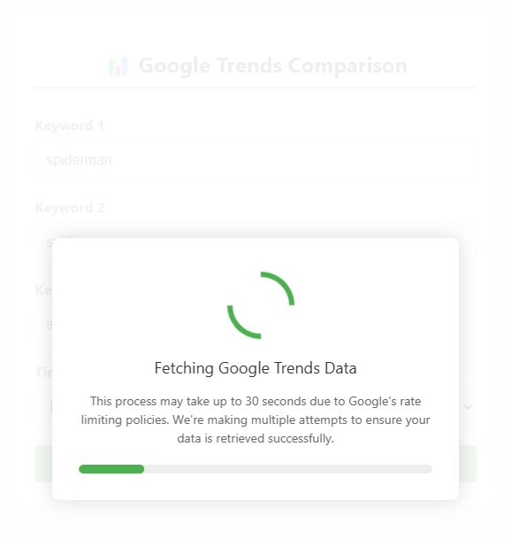
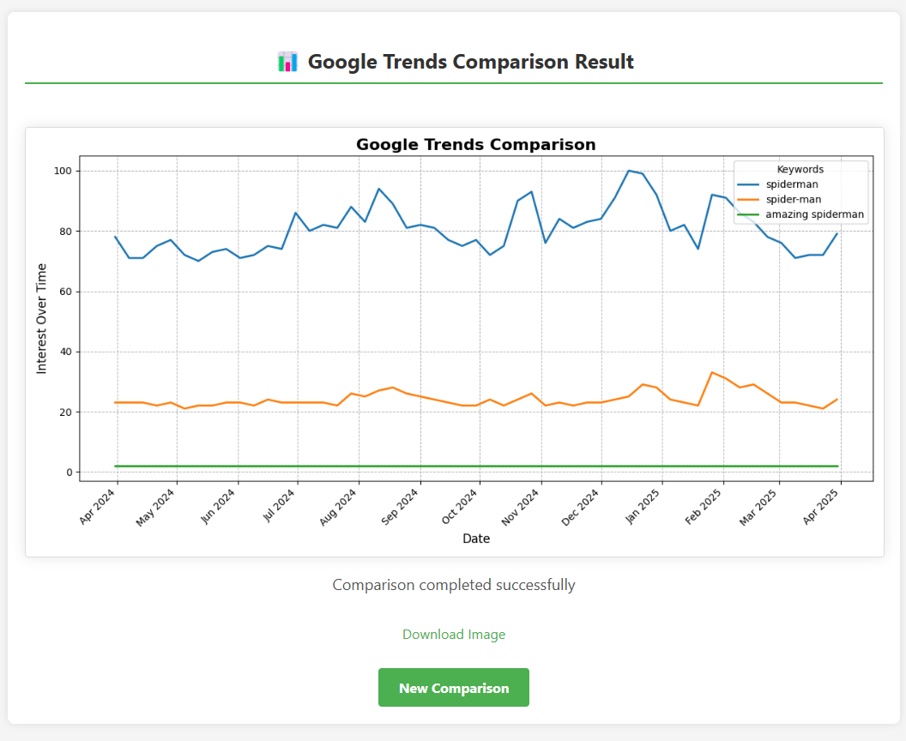
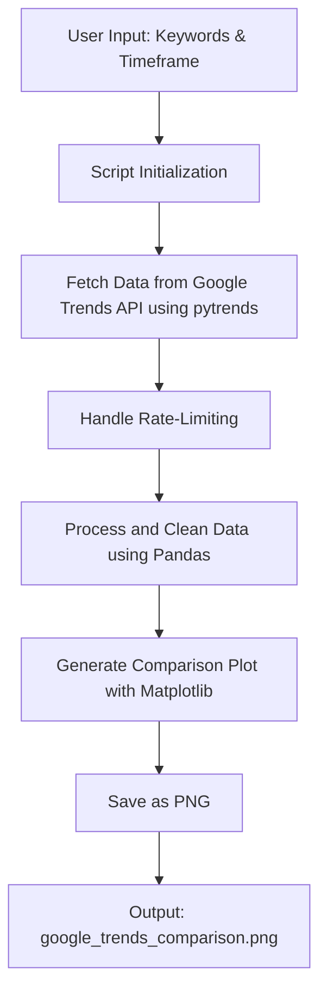
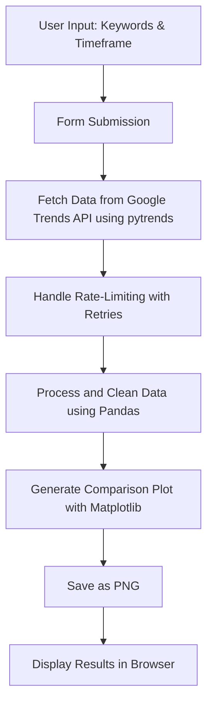

<h1 align="center">📊 <a href="https://github.com/ronknight/google-trends-2">Google Trends Comparison Tool</a></h1>

<h4 align="center">🔧 A Python-based web application to compare the popularity of multiple keywords using Google Trends data with an easy-to-use web interface.</h4>
<p align="center">
  <a href="https://twitter.com/PinoyITSolution"></a>
  <a href="https://github.com/ronknight?tab=followers"></a>
  <a href="https://github.com/ronknight/ronknight/stargazers"></a>
  <a href="https://github.com/ronknight/ronknight/network/members"></a>
  <a href="https://github.com/ronknight/google-trends-2/issues"></a>
  <a href="https://github.com/ronknight/google-trends-2/blob/master/LICENSE"></a>
  <a href="https://github.com/ronknight"></a>
</p>

<p align="center">
  <a href="#overview">Overview</a> •
  <a href="#features">Features</a> •
  <a href="#prerequisites">Prerequisites</a> •
  <a href="#installation">Installation</a> •
  <a href="#how-to-use">How to Use</a> •
  <a href="#web-interface">Web Interface</a> •
  <a href="#visualization">Visualization</a> •
  <a href="#error-handling">Error Handling</a> •
  <a href="#project-structure">Project Structure</a> •
  <a href="#license">License</a>
</p>

## Overview

This Python Flask application allows you to compare the popularity of two or three keywords over a specified timeframe using Google Trends data. The application fetches interest over time for the provided keywords and visualizes the trends using `matplotlib`. The tool provides a user-friendly web interface for submitting keywords and displaying the resulting comparison image directly in your browser.

## Features

- Compare the search interest of **2 to 5 keywords** over a custom time period
- **Multiple timeframe options**, including past day, past 7 days, past 12 months, past 5 years, and 2004 to present
- Clean, responsive **web interface** for easy data input and result display
- **Visual plot output** saved as a `.png` image and displayed in the browser
- **Smart error handling** with user-friendly error messages and suggestions
- **Rate-limiting protection** with automatic retries and exponential backoff
- **Custom user agent rotation** to prevent blocking from Google Trends
- Enhanced reliability for fetching Google Trends data through updated dependencies.
- Improved User-Agent randomization to minimize request blocking.
- Refined retry logic with jitter for more robust connection handling.
- Provides a JSON API endpoint (`/api/compare`) for programmatic access to the Google Trends data.

## Prerequisites

Before running the application, ensure you have Python installed along with the following packages:

- `Flask`
- `Flask-CORS`
- `pytrends`
- `matplotlib`
- `pandas`
- `requests`

## Installation

1. Clone the repository:
   ```bash
   git clone https://github.com/ronknight/google-trends-2.git
   cd google-trends-2
   ```

2. Install the required packages:
   ```bash
   pip install -r requirements.txt
   ```

## How to Use

### Running the Web Application

1. Start the Flask server:
   ```bash
   python app.py
   ```

2. Open your browser and navigate to `http://localhost:5000`

3. Enter your keywords and select a timeframe from the dropdown menu

4. Click "Compare Trends" to generate and view the comparison

## Web Interface

The application provides a clean, user-friendly web interface with the following features:

- **Intuitive Form**: Easy input for two required keywords and up to three additional optional keywords (total of 5).
- **Timeframe Selection**: Dropdown menu with various time period options
- **Loading Indicator**: Visual feedback during data retrieval with a progress bar
- **Error Display**: Clear error messages with helpful suggestions when issues occur
- **Responsive Design**: Works well on both desktop and mobile devices

### Interface Screenshots

#### Form Interface


*The main form where users enter keywords and select a timeframe*

#### Loading Screen


*Loading screen with progress bar shown while fetching data from Google Trends*

#### Results Display


*The results page displaying the Google Trends comparison graph*

### Available Timeframes:

- Past 12 months (default)
- Past 7 days
- Past day
- Past 5 years
- 2004 to present


## Visualization

The Google Trends data is visualized with the following features:

- **Line graph** showing interest over time for each keyword
- **Color coding** to distinguish between different keywords
- **Appropriate date formatting** based on the selected timeframe
- **Grid lines** for better readability
- **Legend** to identify which line represents which keyword

### Process Flow

The flow of the Google Trends Comparison Tool is visualized below using Mermaid:



The flow of the web application process is visualized below:



## Error Handling

The application includes robust error handling:

- **Rate limiting detection** with automatic retries using exponential backoff. Error messages now provide more specific feedback if all retries fail, including a suggestion to use a dedicated proxy service if problems persist.
- **User-friendly error page** with clear explanation of what went wrong
- **Helpful suggestions** for resolving common issues like:
  - Using different keywords
  - Waiting before trying again (for rate-limiting issues)
  - Checking keyword spelling
  - Using shorter timeframes

## Advanced Configuration

### Proxy Configuration

If you are experiencing persistent issues with requests being blocked by Google, or if you prefer to route `pytrends` traffic through a proxy, you can configure the application to use an HTTP/S proxy.

To do this, set the following environment variables before running the application:

```bash
export HTTP_PROXY="http://your_proxy_address:port"
export HTTPS_PROXY="https://your_proxy_address:port"
```

Replace `your_proxy_address:port` with the actual address and port of your proxy server. If both variables are set, `pytrends` will use them for its requests. Ensure your proxy supports HTTPS if you intend to use `HTTPS_PROXY`.

## JSON API Usage

The application provides a JSON API endpoint for programmatic access to Google Trends data.

- **URL:** `/api/compare`
- **Method:** `POST`
- **Request Body:** JSON payload

### Request Payload Parameters

- `keywords`: (list of strings) A list of 2 to 5 keywords to compare. Required.
- `timeframe`: (string) The timeframe for the trends data (e.g., "today 12-m", "today 1-m", "all"). Required.

### Example Request Payload

```json
{
    "keywords": ["python", "javascript", "java"],
    "timeframe": "today 12-m"
}
```

### Success Response

- **Code:** `200 OK`
- **Content:** A JSON object representing the pandas DataFrame in 'table' orientation, which includes schema and data. Dates are formatted in ISO 8601 format (e.g., `YYYY-MM-DDTHH:mm:ss.sssZ`).

#### Example Success Response Structure (Simplified)

```json
{
  "schema": {
    "fields": [
      {"name": "date", "type": "datetime"},
      {"name": "keyword1", "type": "integer"},
      {"name": "keyword2", "type": "integer"},
      // ... up to 5 keywords
      // {"name": "isPartial", "type": "boolean"} // May be present
    ],
    "primaryKey": ["date"],
    "pandas_version": "1.x.x" // Example pandas version
  },
  "data": [
    {"date": "YYYY-MM-DDTHH:mm:ss.sssZ", "keyword1": 75, "keyword2": 80, /* ... */},
    // ... more data points
  ]
}
```
*Note: The actual field names for keywords in the `data` array will match the keywords you provided in the request.*

### Error Responses

- **`400 Bad Request`**: Invalid JSON payload, missing required fields, or invalid keyword/timeframe format. The response body will contain a JSON object with an "error" key describing the issue.
- **`404 Not Found`**: No data available for the given keywords or timeframe.
- **`429 Too Many Requests`**: If the server encounters rate limiting from Google Trends after multiple retries.
- **`500 Internal Server Error`**: For other server-side errors during data processing.

## Project Structure

```
google-trends-2/
├── app.py                  # Main Flask application
├── requirements.txt        # Python dependencies
├── LICENSE                 # MIT License
├── README.md               # Project documentation
├── static/                 # Static assets
│   ├── favicon.ico         # Website favicon
│   └── google_trends_comparison.png  # Generated plot image
└── templates/              # HTML templates
    ├── error.html          # Error display page
    ├── image.html          # Results display page
    └── index.html          # Main form page
```

## License

This project is licensed under the MIT License - see the [LICENSE](LICENSE) file for details.
